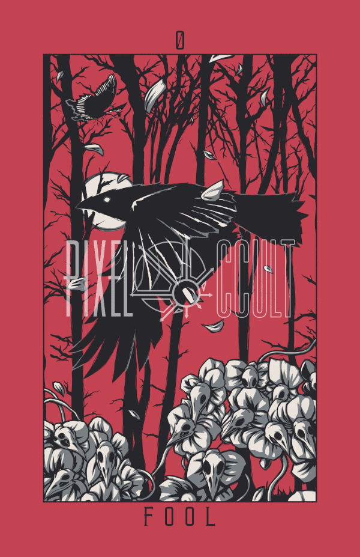

# Lost Hollow
My notes from [Lost Hollow Tarot](http://pixeloccult.com/losthollowtarot/index.html).

<!-- MarkdownTOC levels="1,2" -->

- [Intro](#intro)
- [Majors](#majors)
- [Cups](#cups)
- [Wands](#wands)
- [Swords](#swords)
- [Pentacles](#pentacles)
- [History](#history)

<!-- /MarkdownTOC -->

## Intro
- Tradition: Features a mix, but is really RWS with a tiny dash of Thoth.
- Setting: Arcane macabre woodland.

### Readings
#### Spreads
- Interview spread: Spread performed with new deck to have new deck introduce itself.
- One-card draw: Pull a single card and try to remember meanings.
- Past-present-future: Three-card spread, self-explanatory.
- Celtic Cross: Popular spread that provides info on many different aspects of person's life.

#### Styles
- Inverted/upright: Cards have specific meanings affected by orientation.
- Elemental: Reference elemental associations of cards and how they interact.
    + Element + itself: Strengthen itself
    + Fire + Air: Actively strengthen each other
    + Water + Earth: Passively strengthen each other
    + Fire + Water: Weaken each other
    + Air + Earth: Weaken each other
    + Fire + Earth: Neutral
    + Air + Water: Neutral

#### Major Arcana
- Can be considered major life events or larger plot points in our personal life stories.

## Majors
### 0 Fool
- Element: air.
- Number: 0 acts as placeholder for any conceivable value.
- Crow is flying out to begin a new journey.
- Crow itself reps the animal instinct and trusting of self.
- Crow is not looking at anything, repping trust in the new journey.
- Flowers rep passion, white color reps purity. Delicate falling petals rep higher level of being.
- Skulls rep past experiences - they are part of you but don't control you.
- Trees in background rep challenges to be navigated while moving forward.
- Trees are also motif for wands, symbol of power but not held forcefully.
- Butterfly reps transformation that will take place along the journey.
    + Direction is opposite of crow - butterfly is returning, while crow is leaving.
    + Butterfly is itself beautiful and reps the beauty/enjoyment of the journey.

## Cups
## Wands
## Swords
## Pentacles

## History
- `yyyy_mm_dd` Read pp #. `topic`
- `2023/08/18` Read pp 5. `0_fool`
- `2023/08/17` Read pp 1-4. `intro`
