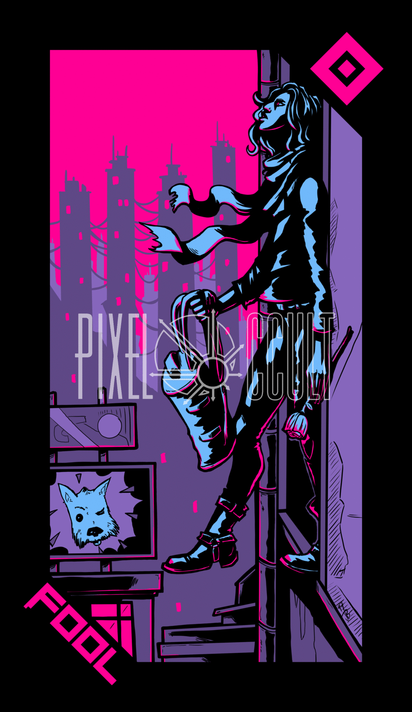

# Neon Moon
My notes from [Neon Moon Tarot](http://pixeloccult.com/neonmoontarot/index.html).

<!-- MarkdownTOC levels="1,2" -->

- [Intro](#intro)
- [Majors](#majors)
- [Vials](#vials)
- [Wires](#wires)
- [Arms](#arms)
- [Zent](#zent)
- [History](#history)

<!-- /MarkdownTOC -->

## Intro
- Tradition: Heavily RWS.
- Setting: Dystopian cyberpunk future. Wealthy and elite but restrained class contrasted with poor and diverse yet free class.

## Majors
### 0 Fool
- Stepping out of building without looking reps start of new journey based on trust.
- Bag reps past memories - they are part of us but don't have to control us.
- Flower reps passion, color of flower reps purity, hold of flower reps higher level/elegance.
- Buildings in background rep challenges along the journey.
- Dog (with inquisitive expression) reps animal instinct that's always watching you.
- Tattered scarf reps how outside society perceives the Fool.

## Vials
## Wires
## Arms
## Zent

## History
- `yyyy_mm_dd` Read pp #-#.
- `2023/08/18` Read 0 Fool.
- `2023/08/17` Read intro.
